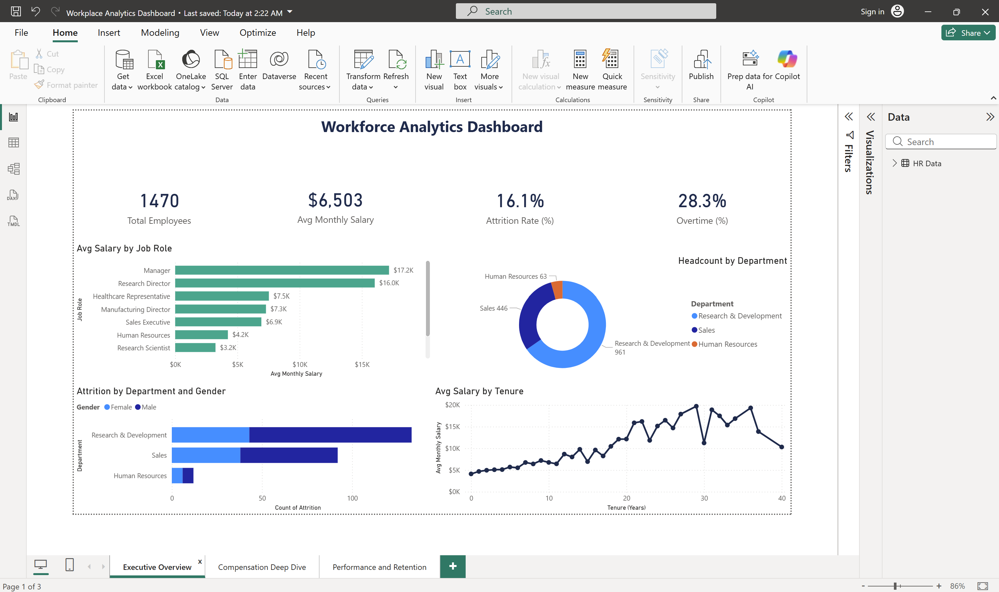
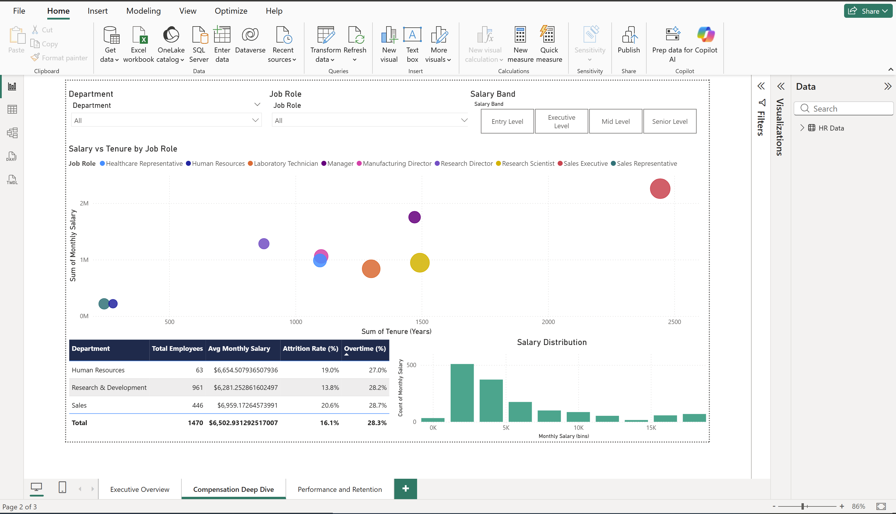

# workforce-analytics-dashboard
Interactive Power BI dashboard analyzing HR workforce data — compensation, attrition, and performance metrics
# Workforce Analytics Dashboard

Interactive Power BI dashboard analyzing HR workforce data across compensation, 
attrition, and performance metrics. Built using the IBM HR Analytics dataset 
with full data cleaning in Power Query and custom DAX measures.

## Dashboard Pages

### Executive Overview

KPI cards for headcount, salary, attrition, and overtime. Salary breakdown 
by job role, departmental headcount, attrition by gender, and salary trends 
over employee tenure.

### Compensation Deep Dive

Interactive slicers for department, job role, and salary band. Scatter plot 
of salary vs tenure, department summary table, and salary distribution histogram.

### Performance & Retention

Heatmap matrix of average performance ratings by job role and department 
with conditional formatting. Attrition counts by role to identify 
high-turnover positions.

## Tools & Techniques

- **Power BI Desktop** — dashboard development and visualization
- **Power Query** — data cleaning, type conversion, calculated columns (Salary Band, Overtime Flag, Annual Salary)
- **DAX** — custom measures (Attrition Rate, Overtime %, Avg Salary, High Performers, Salary per Year Tenure)

## Data Cleaning Steps

- Renamed columns to business-friendly labels
- Set appropriate data types (whole number for salary fields, text for categoricals)
- Created calculated columns: Annual Salary, Salary Band (4 tiers), Overtime Flag
- Removed zero-variance columns (EmployeeCount, StandardHours, Over18)
- Verified data completeness across all fields
- Created Monthly Salary bins (2000 intervals) for distribution analysis

## Data Source

[IBM HR Analytics Employee Attrition & Performance](https://www.kaggle.com/datasets/pavansubhasht/ibm-hr-analytics-attrition-dataset) — 1,470 employee records with 35 attributes.

## Files

- `dashboard/Workplace_Analytics_Dashboard.pbix` — interactive Power BI file (requires Power BI Desktop)
- `dashboard/Workplace_Analytics_Dashboard.pdf` — static PDF export
- `data/hr_analytics.csv` — source dataset
